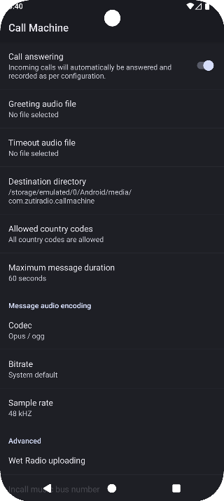

### Call Machine

---

#### Features
- Answers calls automatically with custom greeting audio.
- Offers to limit single message duration to prevent one caller from hoggin the phone line.
- Country code whitelisting - to prevent calls from other countries being automatically answered and costing you money
- Saving recorded messages on **SD card or Internal storage** and even in app's private directory in **`/data` partition**
- Can upload messages to a self-hosted [WetRadio](https://github.com/pisoj/WetRadio) instance.

If you desire the app to include **contact name** in **file names** of recorded messages, please
**manually** grant contacts permission **in settings**.

> **Warning:**
>
> This has **only been tested** on Xiaomi Redmi Note 8T running LineageOS 23.2 (Android 16)
>
> It **may or may not** work on other devices/ROMs.



#### The application has <u>zero dependencies</u>

[](https://github.com/pisoj/call-machine/blob/main/app/build.gradle.kts#L44)

### Supported audio codecs
| Codec          | Containers     | File extension    |
|----------------|----------------|-------------------|
| Opus           | ogg, mp4, webm | .ogg, .m4a, .wemb |
| AAC-LC         | mp4, adts      | .m4a, .aac        |
| HE-AAC v2      | mp4, adts      | .m4a, .aac        |
| AMR Wideband   | amr, 3gpp      | .amr, .3gpp       |
| AMR Narrowband | amr, 3gpp      | .amr, .3gpp       |

---

### Compile from source

The app itself **can be** compiled using **Android Studio** just like any other
android application. It can also be compiled with `Gradle` from **command line**:
```shell
./gradlew :app:build
```

When you're done compiling move the apk from `app/build/outputs/apk/debug/` to `MagiskModule/system/priv-app/CallMachine/`
and **rename** it to `CallMachine.apk`.

Now go to `MagiskModule/` and ZIP `META-INF`, `system` and `module.prop` together.
Make sure **not to create** a parent directory inside the ZIP archive. These three
items should be in the **root** of the ZIP file, otherwise Magisk is going to
**reject** the module.

> Note: **Binary files** inside `MagiskModule/system/bin` were obtained from [here](https://github.com/hasanbulat/tinyalsa-ndk/tree/fbd19bcda2cf4bc8d2b01e469440252f1a543e24/libs/armeabi).
